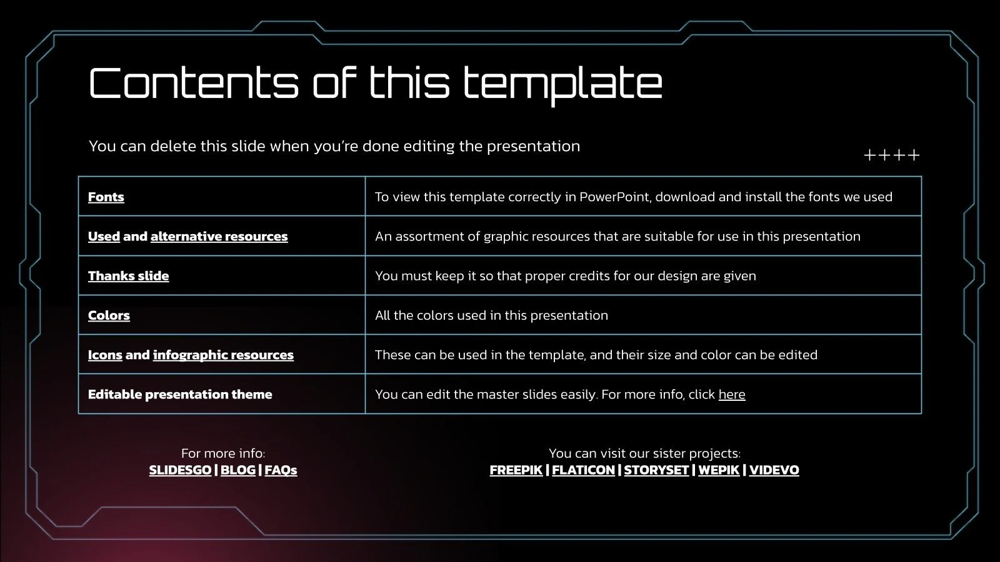
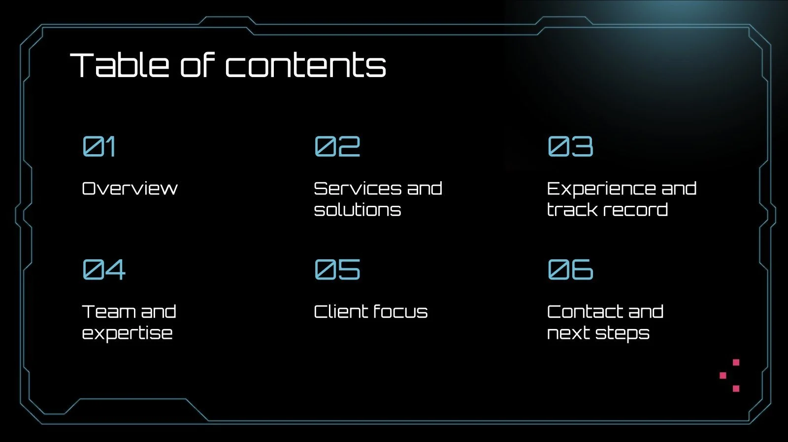

# EX01 Developing a Simple Webserver
## Date:

## AIM:
To develop a simple webserver to serve html pages.

## DESIGN STEPS:
### Step 1: 
HTML content creation.

### Step 2:
Design of webserver workflow.

### Step 3:
Implementation using Python code.

### Step 4:
Serving the HTML pages.

### Step 5:
Testing the webserver.

## PROGRAM:
<!DOCTYPE html>
<html lang="en">

<head>
    <meta charset="UTF-8">
    <meta name="viewport" content="width=device-width, initial-scale=1.0">
    <title>Document</title>
    <link rel="stylesheet" href="https://cdn.jsdelivr.net/npm/bootstrap-icons@1.11.3/font/bootstrap-icons.min.css">
    <link href="https://cdn.jsdelivr.net/npm/bootstrap@5.3.3/dist/css/bootstrap.min.css" rel="stylesheet"
        integrity="sha384-QWTKZyjpPEjISv5WaRU9OFeRpok6YctnYmDr5pNlyT2bRjXh0JMhjY6hW+ALEwIH" crossorigin="anonymous">
</head>

<body>
    
    

        

            

                
                
            

            

                <a href=""><b>HOME</b></a>
                <a href=""><b>GAME</b></a>
                <a href=""><b>CAR GAME</b></a>
                <a href=""><b>DRIVING</b></a>
                <a href=""><b>ABOUT</b></a>
            

            

                <input style="height: 30px;
                width: 80%;
                background-image : url(search.png);
                background-size: contain;
                background-repeat : no-repeat;
                border-radius : 15px;
                padding-left : 40px; " type="text" name="search" >

            

        

        

            

                

                    

                        <button type="button" data-bs-target="#carouselExampleIndicators" data-bs-slide-to="0"
                            class="active" aria-current="true" aria-label="Slide 1"></button>
                        <button type="button" data-bs-target="#carouselExampleIndicators" data-bs-slide-to="1"
                            aria-label="Slide 2"></button>
                        <button type="button" data-bs-target="#carouselExampleIndicators" data-bs-slide-to="2"
                            aria-label="Slide 3"></button>
                        <button type="button" data-bs-target="#carouselExampleIndicators" data-bs-slide-to="3"
                            aria-label="Slide 4"></button>
                        <button type="button" data-bs-target="#carouselExampleIndicators" data-bs-slide-to="4"
                            aria-label="Slide 5"></button>
                    

                    

                        

                            
                        

                        

                            
                        

                        

                            
                        

                        

                            
                        

                        

                            
                        

                    

                    <button class="carousel-control-prev" type="button" data-bs-target="#carouselExampleIndicators"
                        data-bs-slide="prev">
                        
                        Previous
                    </button>
                    <button class="carousel-control-next" type="button" data-bs-target="#carouselExampleIndicators"
                        data-bs-slide="next">
                        
                        Next
                    </button>
                

            

        

    

    
</body>

</html>

## OUTPUT:

## RESULT:
The program for implementing simple webserver is executed successfully.
